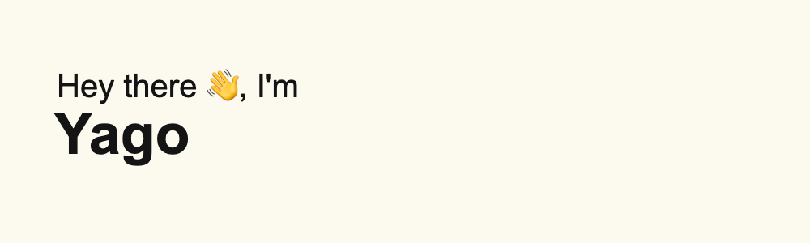

###

<h3 align="left">☎️ Contact</h3>

###

  
  

###

<h3 align="left">👨🏻‍💻 About me</h3>

###

  I'm a <strong>Full-stack developer</strong> based in Argentina with<strong> more than 2 years of experience</strong> in the software industry.

  My focus area for the past few years has been front-end development with <strong>React</strong>, but I'm also skilled in back-end development with <strong>Node</strong>.

  - 🔭 I’m working as a full-stack developer. 
  - 📚 I'm currently learning hexagonal architecture, NestJS and cypress. 
  - ⚡ In my free time I like to go swimming.

###

<h3 align="left">💻 Technologies</h3>

###

  
  
  
  
  
  
  
  
  
  
  
  
  
  
  
  
  
  
  
  
  
  
  
  
  
  
  
  
  
  
  
  
  
  

###

<h3 align="left">🛠 Tools</h3>

###

  
  
  
  
  
  
  
  

